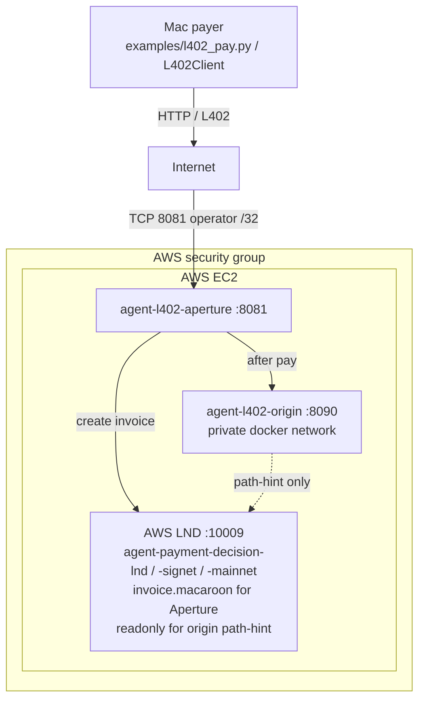
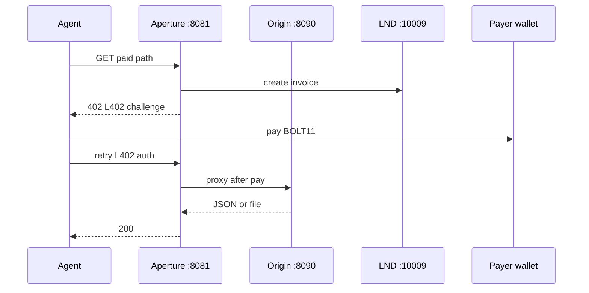
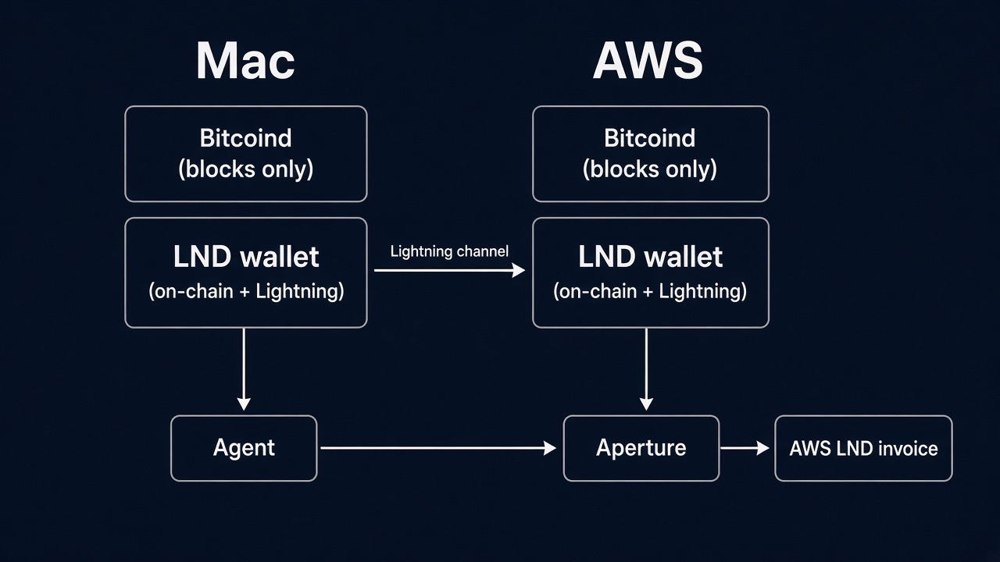
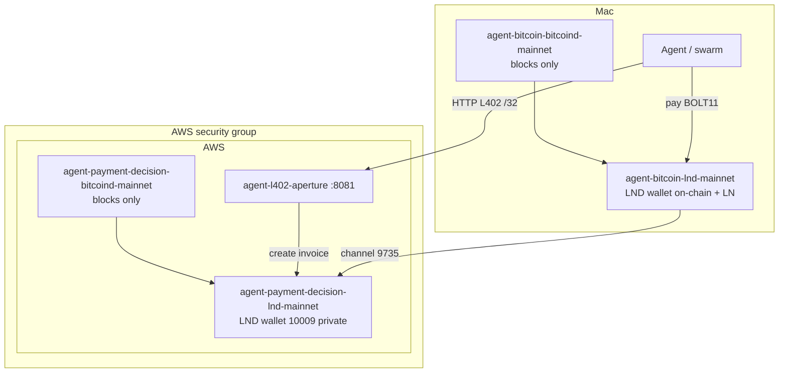
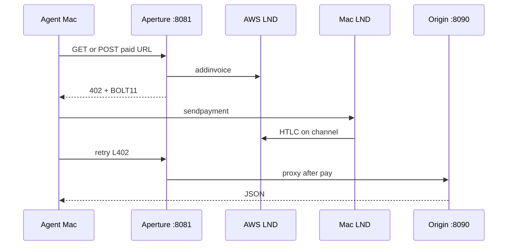

# Architecture

Diagrams for engineers. Runtime and operator detail stays in [l402-aperture.md](./l402-aperture.md) and [backend.md](./backend.md).

## L402 deployment

Public door is 8081 /32; LND is not world-open.

## L402 request sequence

Example paid path: `GET /paid/finance/mempool-feerate`. Same 402 → pay → retry for other paid GET/POST paths.

- Unpaid requests stop at 402.
- Finance/Nostr tools typically 100 sats; hello/PDF/PNG 1000.
- 8081 allowlist is separate from payment.
- Origin does not charge; Aperture is the cash register.

Two-agent swarm (who pays one GET): [examples/swarm_l402.md](../examples/swarm_l402.md) (live demo pays from the Mac).

## Wallets and chain backends

Mainnet names; signet/regtest are analogous ([l402-aperture.md](./l402-aperture.md) table).

Each host has its own **bitcoind** (blocks) and its own **LND wallet** (keys, on-chain sats, channel sats). bitcoind does not hold spend keys in this lab — LND `wallet.db` does.

In operator terms: the “Bitcoin wallet” is LND on-chain (`walletbalance` / `newaddress`). The “Lightning wallet” is the **same** LND’s channel balances (`listchannels`). Dual-node lab = **two** LND wallets, not four key stores.

*Two LND wallets; bitcoind is chain data; live L402 pays from Mac.*

### Wallet deployment

Public door is 8081 /32; LND gRPC 10009 is not world-open.

### Live L402 across two wallets

AWS LND paying that invoice is rejected (self-pay). Payer is Mac LND.
