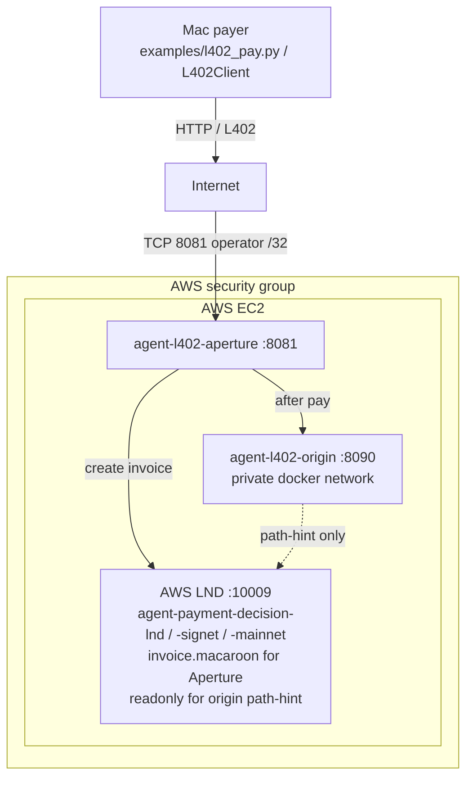
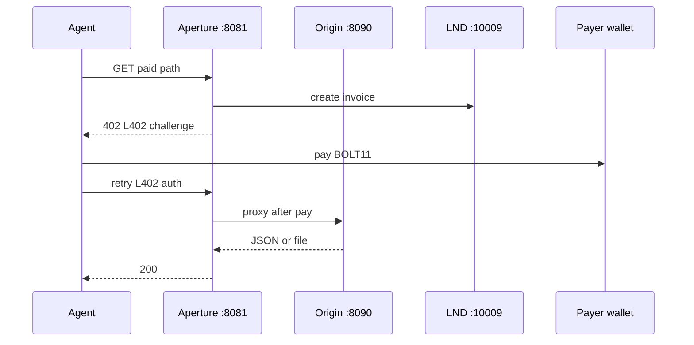

# Architecture

Diagrams for engineers. Runtime and operator detail stays in [l402-aperture.md](./l402-aperture.md) and [backend.md](./backend.md).

## L402 deployment

Public door is 8081 /32; LND is not world-open.

## L402 request sequence

Example paid path: `GET /paid/finance/mempool-feerate`. Same 402 → pay → retry for other paid GET/POST paths.

- Unpaid requests stop at 402.
- Finance/Nostr tools typically 100 sats; hello/PDF/PNG 1000.
- 8081 allowlist is separate from payment.
- Origin does not charge; Aperture is the cash register.
