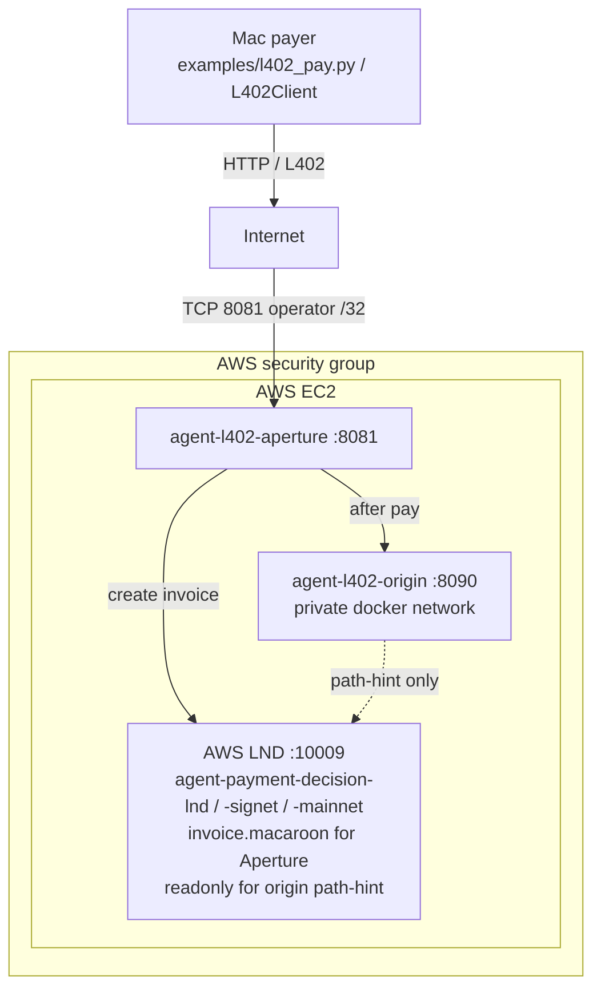

# Architecture

Diagrams for engineers. Runtime and operator detail stays in [l402-aperture.md](./l402-aperture.md) and [backend.md](./backend.md).

## L402 deployment

Public door is 8081 /32; LND is not world-open.
