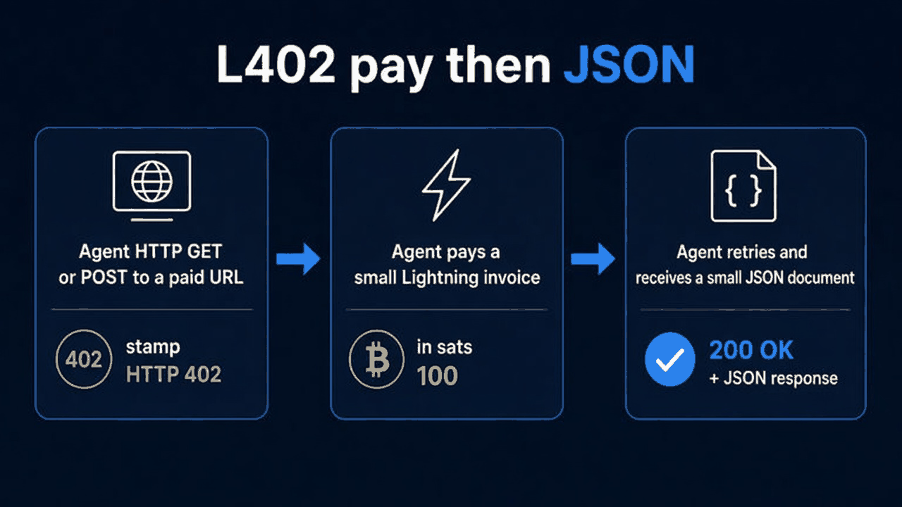

# L402 tool suites (for agents)

Paid JSON tools behind Aperture L402. This page is for an **external autonomous agent** (or its developer): what each tool is for, how to call it, one example. Operators who run the gateway: [l402-aperture.md](./l402-aperture.md). SDK client: [SDK.md — L402](../SDK.md#l402-aperture).

## What this is

Aperture sits in front of a dummy HTTP origin on **`:8081`**. Unpaid `GET`/`POST` to a paid path returns **HTTP 402** plus a Lightning invoice. Pay at least **`MIN_PAYMENT_SATS`** (default **100**), then retry with L402 auth (`Authorization: L402 <macaroon>:<preimage>`). Prefer [`L402Client`](../SDK.md#l402-aperture) or [`examples/l402_pay.py`](../examples/l402_pay.py) so that handshake is automatic.

Finance and Nostr tool paths are typically **100 sats**. Demo `hello` / PDF / PNG stay **1,000 sats**. There is **no platform fee**; the L402 price **is** the Lightning amount.

This is **not** a public catalog. The operator’s security group is **`/32`**. An external agent only reaches these URLs if the operator exposes a host the agent can call.

## How an external agent uses any tool



*Unpaid request → Lightning pay → JSON. Typical tool price 100 sats.*

1. Get a reachable base URL from the operator (`http://<L402_HOST>:8081`).
2. Call with `L402Client(..., expected_price_sats=100)` or `l402_pay.py --price 100` (the SDK default expected price is **1000**, so 100-sat paths need `--price 100`).
3. **GET** for Bitcoin-suite query tools. **POST** JSON for Lightning and Nostr tools (GET → **405**).
4. Do **not** put BOLT11 in query strings. POST it in JSON (`--json`).
5. Read `ttl_s` and cache. Do not poll every second. Local inspect tools (`ttl_s` 0) are still not a hot loop.
6. Wiring, SG, and restart: [l402-aperture.md](./l402-aperture.md). Mainnet pays still need the usual latches on the payer.

Placeholder host below is `http://<L402_HOST>:8081`. Use a **test** invoice for decode/preflight examples, not a live mainnet pay request.

## Bitcoin suite

**Function:** on-chain fee / fullness / FX digest for an agent about to touch **L1**. Lightning-only pays do **not** need feerate.

### GET `/paid/finance/mempool-feerate`

Job: sat/vB bands (`fast` / `medium` / `slow`) from a public fee API cache. Use this when you will broadcast or size an on-chain tx. Not a mempool.space UI.

```bash
uv run python examples/l402_pay.py \
  --url http://<L402_HOST>:8081/paid/finance/mempool-feerate --price 100
```

### GET `/paid/finance/mempool-backlog`

Job: how full the mempool is (`tx_count`, `vsize`, `total_fee_sats`) — not fee bands. Pair with feerate when you care whether the chain is congested.

```bash
uv run python examples/l402_pay.py \
  --url http://<L402_HOST>:8081/paid/finance/mempool-backlog --price 100
```

### GET `/paid/finance/fee-for-vsize?vsize=`

Job: `ceil(vsize × sat/vB)` for a tx size in **virtual bytes** (not weight). Range **110–100000**. Same cache as feerate.

```bash
uv run python examples/l402_pay.py \
  --url 'http://<L402_HOST>:8081/paid/finance/fee-for-vsize?vsize=250' --price 100
```

### GET `/paid/finance/confirm-target`

Job: map a wait window (`minutes` 1–60) or named band (`fast`|`medium`|`slow`) onto `sat_vb`. Optional `vsize` adds `fee_sats`. Snap: 1–20 fast, 21–45 medium, 46–60 slow.

```bash
uv run python examples/l402_pay.py \
  --url 'http://<L402_HOST>:8081/paid/finance/confirm-target?minutes=30' --price 100
```

### GET `/paid/finance/btc-usd`

Job: USD per 1 BTC from one public JSON URL, plus `sats_per_usd`. Pass-through mark, **not** our index and **not** an FX oracle.

```bash
uv run python examples/l402_pay.py \
  --url http://<L402_HOST>:8081/paid/finance/btc-usd --price 100
```

## Lightning suite

**Function:** inspect / gate / hint **before** `pay_invoice`. Suggested order: **decode → preflight → path-hint → pay**. Decode and preflight are in-process (no LND). **path-hint** is what **AWS agent LND** sees via readonly QueryRoutes; operators using their own `lnd` may skip paying that path.

### POST `/paid/finance/ln-invoice-decode`

Job: parse a BOLT11 for network, `amount_sats`, dest, payment hash, expiry. No LND. Does not echo the full invoice.

```bash
uv run python examples/l402_pay.py \
  --url http://<L402_HOST>:8081/paid/finance/ln-invoice-decode \
  --price 100 --method POST \
  --json '{"bolt11":"<test invoice>"}'
```

### POST `/paid/finance/ln-invoice-preflight`

Job: reuse that parse and return `allow` plus reason codes (`expired`, `zero_amount`, `below_floor`, `above_max_sats`, `network_mismatch`). Floor is **100** sats. Not a route check.

```bash
uv run python examples/l402_pay.py \
  --url http://<L402_HOST>:8081/paid/finance/ln-invoice-preflight \
  --price 100 --method POST \
  --json '{"bolt11":"<test invoice>","max_sats":50000,"network":"bitcoin"}'
```

### POST `/paid/finance/ln-path-fee-hint`

Job: first-path fee hint (`fee_sats`, `hop_count`) from AWS agent LND QueryRoutes. POST JSON XOR: `{ "dest_pubkey": "<66 hex>", "amount_sats": 1000 }` **or** `{ "bolt11": "<test invoice>" }`. Not Terminal/RTL; no route dump.

```bash
uv run python examples/l402_pay.py \
  --url http://<L402_HOST>:8081/paid/finance/ln-path-fee-hint \
  --price 100 --method POST \
  --json '{"dest_pubkey":"<66 hex>","amount_sats":1000}'
```

## Nostr suite

**Function:** **local** identity checks. These three do **not** talk to a relay (no 503 from relays). They are not Damus, not a zap wallet, and not **NWC (Nostr Wallet Connect)**. NWC is a way for an agent to talk to a Lightning wallet over Nostr using a URI, instead of holding an LND admin macaroon.

Agent identity, NWC, and NIP-46 live elsewhere: [README — Nostr](../README.md#nostr-agent-identity), [nostr-agent-identity.md](./nostr-agent-identity.md), [nwc-automatic-wallets.md](./nwc-automatic-wallets.md).

### POST `/paid/nostr/event-verify`

Job: NIP-01 id hash + Schnorr check on a **bare** event JSON. Response omits `content`, `tags`, and `sig`.

```bash
uv run python examples/l402_pay.py \
  --url http://<L402_HOST>:8081/paid/nostr/event-verify \
  --price 100 --method POST \
  --json '{"id":"<64 hex>","pubkey":"<64 hex>","created_at":1,"kind":1,"tags":[],"content":"","sig":"<128 hex>"}'
```

### POST `/paid/nostr/npub-decode`

Job: NIP-19 bech32 → `type` + hex (`npub` / `note` / `nprofile` / `nevent`). **`nsec` is rejected** (no secret hex). Do not echo `entity`.

```bash
uv run python examples/l402_pay.py \
  --url http://<L402_HOST>:8081/paid/nostr/npub-decode \
  --price 100 --method POST \
  --json '{"entity":"npub1..."}'
```

### POST `/paid/nostr/zap-receipt-inspect`

Job: decide whether an event is a NIP-57 **zap receipt** (kind **9735**) and read claimed amount + targets. Amount from the **bolt11 tag only**. Structural inspect + event sig — **not** Appendix F wallet validation and **not** a zap wallet. Does not echo bolt11.

```bash
uv run python examples/l402_pay.py \
  --url http://<L402_HOST>:8081/paid/nostr/zap-receipt-inspect \
  --price 100 --method POST \
  --json '{"id":"...","pubkey":"...","created_at":1,"kind":9735,"tags":[],"content":"","sig":"..."}'
```

## What this is not

- Not a **mempool.space** replacement or explorer
- Not an **FX oracle** or CoinGecko substitute (`btc-usd` is one public pass-through)
- Not **Terminal / RTL** (path-hint is one QueryRoutes scalar, not a route UI)
- Not **Damus** or a Nostr client (no relay on these three tools)
- Not a **zap wallet** (zap-receipt-inspect does not pay or validate LNURL)
- Not a world-open catalog (operator `/32`)
- Do not put Aperture in front of `/pay`, `/invoices`, or `/balance`
